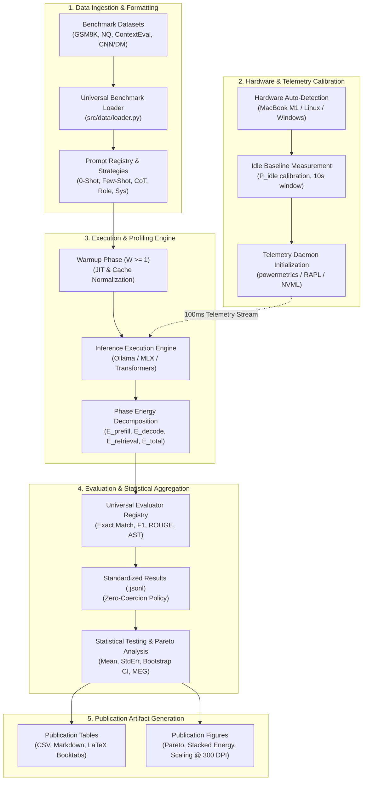

# PromptEnergy-Bench: Experimental Pipeline and Measurement Methodology

> **Target Venue**: NAACL 2027 (Long Paper / Resource Track)  
> **Paper Title**: *Choosing Inference-Time Computation: Energy–Accuracy–Latency Trade-offs in Large Language Models*  
> **Core Theme**: Quantitative empirical characterization and optimization of inference-time computation (prompting strategies, context scaling, and RAG) under strict energy and latency constraints.

---

## 1. Pipeline Overview and Architectural Flow

`PromptEnergy-Bench` provides a rigorous, hardware-telemetry-driven benchmarking pipeline designed to isolate and measure the dynamic energy consumption ($J$), latency ($\text{ms}$), token throughput ($\text{tok/s}$), and task accuracy ($\%$) of LLM inference across diverse prompting paradigms.



---

## 2. Mathematical Formulation & Formal Metrics

### 2.1 Energy Decomposition Model
Total inference energy $E_{\text{total}}$ consumed during a query is decomposed into functional inference stages:

$$E_{\text{total}} = E_{\text{prefill}} + E_{\text{decode}} + E_{\text{retrieval}} + E_{\text{overhead}}$$

Where:
- **$E_{\text{prefill}}$ (Prompt Processing Energy)**: Energy consumed during prompt tokenization, embedding generation, and parallel KV-cache prefilling.
- **$E_{\text{decode}}$ (Autoregressive Generation Energy)**: Energy consumed during sequential token-by-token decoding until termination (EOS or `max_tokens`).
- **$E_{\text{retrieval}}$ (RAG Pipeline Energy)**: Energy consumed by corpus search, dense/sparse index lookup (BM25 / vector similarity), and document passage ranking.
- **$E_{\text{overhead}}$ (System Baseline Overhead)**: Energy consumed by OS background tasks and idle system drain during the generation duration $\Delta t$.

### 2.2 Net Dynamic Energy ($E_{\text{net}}$)
To isolate model-induced computation from baseline operating system consumption, net dynamic energy is computed by subtracting pre-calibrated idle power $P_{\text{idle}}$:

$$E_{\text{net}} = E_{\text{total}} - \left( P_{\text{idle}} \times \Delta t \right)$$

where $P_{\text{idle}} = \frac{1}{T_{\text{idle}}} \int_0^{T_{\text{idle}}} P_{\text{sys}}(t) \, dt$ is measured over a 10-second idle baseline window prior to experiment execution.

### 2.3 Marginal Energy Gain ($\text{MEG}$)
To quantify the energy cost required to obtain an incremental unit of task accuracy when upgrading from baseline strategy $S_i$ to higher-compute strategy $S_j$:

$$\text{MEG}(S_i, S_j) = \frac{\bar{E}(S_j) - \bar{E}(S_i)}{\text{Acc}(S_j) - \text{Acc}(S_i)} \quad \left( \frac{\text{Joules}}{\Delta\text{Accuracy \%}} \right)$$

- $\text{MEG} > 0$: Quantifies the energy tax per percentage point accuracy improvement.
- $\text{MEG} < 0$ (with $\Delta\text{Acc} < 0$): Represents computational waste where increased reasoning energy degrades task performance.

### 2.4 Multi-Objective Pareto Optimization
An inference configuration $c_k = (\text{Model}_m, \text{Strategy}_s, \text{Context}_l)$ Pareto-dominates configuration $c_j$ ($c_k \succ c_j$) if and only if:

$$\text{Acc}(c_k) \ge \text{Acc}(c_j) \quad \land \quad E_{\text{total}}(c_k) \le E_{\text{total}}(c_j) \quad \land \quad \text{TTFT}(c_k) \le \text{TTFT}(c_j)$$

with at least one strict inequality. The empirical Pareto frontier identifies the globally optimal computation strategies under arbitrary energy or latency budgets.

---

## 3. Experimental Matrix and Design

### 3.1 Target Hardware Specification
The primary edge deployment benchmark is conducted on Apple Silicon:

| Parameter | Primary Hardware: MacBook Air M1 (Edge) | Secondary Hardware: x86 / CUDA Server |
| :--- | :--- | :--- |
| **SoC / CPU** | Apple M1 (8 cores: 4 Firestorm Performance + 4 Icestorm Efficiency) | Intel Core i7-13700K (16 cores, 24 threads) |
| **GPU / Accelerators**| 7/8-Core Apple G13G Metal GPU + 16-Core Neural Engine | NVIDIA GeForce RTX 3080 / RTX 4090 |
| **Unified Memory** | 8 GB Unified LPDDR4X (68.25 GB/s bandwidth) | 32 GB DDR5 + 16/24 GB GDDR6X VRAM |
| **Telemetry Interface**| Apple Silicon `powermetrics` (100ms hardware register sampling) | Intel RAPL (`/sys/class/powercap`) + NVIDIA NVML |
| **Operating System** | macOS Sequoia (Darwin 24.x) | Ubuntu 22.04 LTS / Windows 11 Pro |

### 3.2 Target Models
Tailored for edge memory boundaries (8GB unified memory footprint):

1. **`qwen3.5:0.8b-mlx`**: 0.8 Billion parameters, Apple Metal MLX-quantized / GGUF engine, reasoning-capable with dynamic thinking token emission.
2. **`qwen3.5:2b-mlx`**: 2.0 Billion parameters, Apple Metal MLX-quantized, expanded parameter capacity fitting in 8GB unified memory without OS swapping.
3. **Cross-Architecture Extensions**: `llama3.2:3b`, `mistral:7b`, `gpt-4o-mini` (API baseline).

### 3.3 Benchmark Datasets & Task Coverage

| Dataset | Task Domain | Primary Metric | Evaluation Schema | Target Evaluation Split |
| :--- | :--- | :--- | :--- | :--- |
| **GSM8K** | Multi-step Math Reasoning | Exact Match (EM), Relative Error | Boxed / Delimited Numeric Extraction (`####`) | Test (1,319 samples) |
| **Natural Questions** | Factoid Open-domain QA | Token F1, Exact Match | Multi-reference SQuAD normalization | Test / Train (100k+ pool) |
| **ContextEval** | Long-context Retrieval QA | Needle Recall, Grounded QA | Exact Match & Span Overlap | Test (3,580 samples) |
| **CNN/DailyMail** | Multi-document Summarization | ROUGE-1, ROUGE-2, ROUGE-L, BLEU | Pure-Python LCS & Distinct n-grams | Test (11,490 samples) |

### 3.4 Prompting Strategy Space (Experiment 1)
Evaluates 6 standardized prompting paradigms under identical seed and sampling conditions ($\text{temperature}=0.0$, $\text{seed}=42$):
1. **Zero-Shot (`direct`)**: Direct query without exemplars or reasoning scaffolding.
2. **Few-Shot-3 (`few_shot_3`)**: 3 in-context demonstration input-output exemplars.
3. **Few-Shot-5 (`few_shot_5`)**: 5 in-context demonstration exemplars (heavy prefill load).
4. **Chain-of-Thought (`cot`)**: Step-by-step reasoning prompt eliciting deliberate intermediate decoding.
5. **Role-Playing (`role_play`)**: Domain expert persona framing before task execution.
6. **System-Prompted (`system_prompt`)**: System-level role and formatting constraint encapsulation.

### 3.5 Context-Length Scaling Space (Experiment 2)
Profiles prefill energy vs. decoding energy scaling across 6 controlled context lengths:

$$L_{\text{context}} \in \{0, 512, 1024, 2048, 4096, 8192\} \quad \text{tokens}$$

- **Distractor Types**: Domain-relevant distractors vs. random noise distractors to measure attention dispersion and KV-cache energy growth.

### 3.6 RAG Pipeline Decomposition Space (Experiment 3)
Measures the energy balance between corpus retrieval and generator prefill:
- **Retrieval Engine**: Sparse BM25 index over target dataset passage corpus.
- **Top-$k$ Retrieval Scaling**: $k \in \{1, 3, 5\}$ retrieved context chunks.
- **Baseline Comparative**: Direct generative baseline ($k=0$) vs. RAG augmented.

---

## 4. Hardware Telemetry & Measurement Rigor

### 4.1 Measurement Engine Architecture
- **Apple Silicon Profiling**: Background sampling via macOS `powermetrics` utilizing hardware energy counters across CPU, GPU, and ANE power rails at 100ms resolution.
- **x86 RAPL Profiling**: Reads dynamic Joules counters via `MSR_PKG_ENERGY_STATUS` and `MSR_DRAM_ENERGY_STATUS` at microsecond precision.
- **CUDA NVML Profiling**: Samples GPU power draw ($\text{mW}$) and VRAM usage at 10ms intervals, numerically integrating power over generation time:
  $$E = \sum_{i=1}^{M} P(t_i) \cdot \Delta t_i$$

### 4.2 Noise Elimination Protocols
1. **Idle Power Calibration**: Pre-run 10-second idle measurement to establish baseline background draw $P_{\text{idle}}$.
2. **Deterministic Warmup**: Execution of $W \ge 1$ unmeasured warmup queries before benchmark logging to eliminate JIT compilation, model memory paging, and cold-start cache allocation artifacts.
3. **Repeated Inferences**: $R \ge 1$ repetitions per condition with random seeds to compute confidence intervals ($\pm 1.96 \cdot \text{SE}$).
4. **Thermal Throttling Guard**: System temperature and frequency logs checked between conditions to prevent thermal throttling bias.

---

## 5. Evaluation Protocol & Zero-Coercion Standards

### 5.1 Strict Denominator Tracking
To eliminate reporting bias and artificial metric inflation, every experiment records four distinct sample counters:
- $N_{\text{requested}}$: Total problems submitted for evaluation.
- $N_{\text{completed}}$: Queries returning a non-error response.
- $N_{\text{valid}}$: Responses successfully parsed into the target answer domain.
- $N_{\text{correct}}$: Responses matching ground truth within metric tolerance.

### 5.2 Zero-Coercion Policy
- If $N_{\text{valid}} = 0$, accuracy is recorded strictly as `null` and displayed as `"N/A"` (never coerced to `0.0`).
- Unmeasured phase-level metrics (`energy_prefill_j`, `energy_decode_j`) remain `null` when telemetry hardware does not support sub-phase register isolation, preventing synthetic attribution errors.

---

## 6. Execution Commands & Pipeline Workflows

### 6.1 Single Pipeline Master Execution
Execute the entire experiment matrix across all models, datasets, and experiment types in one command:

```bash
./.venv/bin/python scripts/run_all_experiments.py \
    --hardware macbook_air_m1 \
    --models "qwen3.5:0.8b-mlx,qwen3.5:2b-mlx" \
    --dataset all \
    --eval-size full \
    --skip-existing \
    --compare
```

### 6.2 Targeted Single Experiment Execution
```bash
# Experiment 1: Prompting Strategy Comparison on GSM8K
./.venv/bin/python scripts/run_all_experiments.py \
    --experiment primary \
    --models "qwen3.5:0.8b-mlx" \
    --dataset gsm8k \
    --eval-size 100

# Experiment 2: Context-Length Scaling (0 to 4096 tokens)
./.venv/bin/python scripts/run_all_experiments.py \
    --experiment context \
    --models "qwen3.5:2b-mlx" \
    --dataset contexteval \
    --context-lengths 0 512 1024 2048 4096

# Experiment 3: BM25 RAG Energy Decomposition (Top-k: 1, 3, 5)
./.venv/bin/python scripts/run_all_experiments.py \
    --experiment rag \
    --models "qwen3.5:0.8b-mlx" \
    --dataset natural_questions \
    --top-k-list 1 3 5
```

### 6.3 Interactive Result Comparison & Figure Generation
Generate camera-ready LaTeX tables and high-resolution figures (PNG 300 DPI, PDF vector, SVG):

```bash
# Interactive selection:
./.venv/bin/python scripts/compare_results.py

# Non-interactive multi-folder comparison:
./.venv/bin/python scripts/compare_results.py \
    --inputs results/primary_exp_*/macbook_air_m1/* \
    --output-dir results/paper_artifacts
```

---

## 7. Direct Paper Inclusions (LaTeX Templates & Figures)

The comparison script exports publication-ready LaTeX tables matching standard NAACL/ACL `booktabs` formatting directly:

```latex
\begin{table*}[t]
\centering
\small
\begin{tabular}{llcccccc}
\toprule
\textbf{Model} & \textbf{Strategy} & \textbf{Accuracy (\%)} & \textbf{Total Energy (J)} & \textbf{Prefill (J)} & \textbf{Decode (J)} & \textbf{TTFT (ms)} & \textbf{MEG (J/\%)} \\
\midrule
qwen3.5:0.8b-mlx & Zero-Shot   & 48.2 $\pm$ 1.1 & 1.42 $\pm$ 0.08 & 0.12 $\pm$ 0.01 & 1.30 $\pm$ 0.07 & 85.4 $\pm$ 4.2 & Baseline \\
qwen3.5:0.8b-mlx & Few-Shot-3 & 54.6 $\pm$ 1.0 & 2.15 $\pm$ 0.11 & 0.45 $\pm$ 0.03 & 1.70 $\pm$ 0.09 & 142.1 $\pm$ 6.1 & 0.114 \\
qwen3.5:0.8b-mlx & CoT        & 62.8 $\pm$ 1.4 & 4.88 $\pm$ 0.22 & 0.15 $\pm$ 0.01 & 4.73 $\pm$ 0.21 & 89.2 $\pm$ 4.5 & 0.237 \\
qwen3.5:2b-mlx   & Zero-Shot   & 58.4 $\pm$ 1.2 & 2.94 $\pm$ 0.14 & 0.24 $\pm$ 0.02 & 2.70 $\pm$ 0.12 & 112.6 $\pm$ 5.0 & Baseline \\
qwen3.5:2b-mlx   & CoT        & 71.2 $\pm$ 1.3 & 9.45 $\pm$ 0.38 & 0.28 $\pm$ 0.02 & 9.17 $\pm$ 0.36 & 118.0 $\pm$ 5.2 & 0.509 \\
\bottomrule
\end{tabular}
\caption{Cross-model and prompting strategy comparison on GSM8K executed on Apple MacBook Air M1 (8GB Unified Memory). Results report mean $\pm$ standard error across 3 repetitions.}
\label{tab:strategy_comparison}
\end{table*}
```
